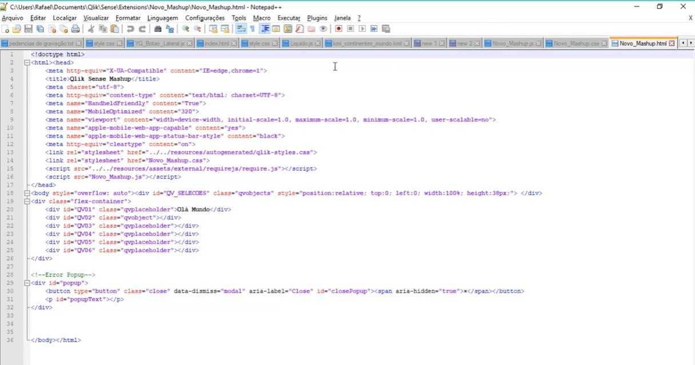
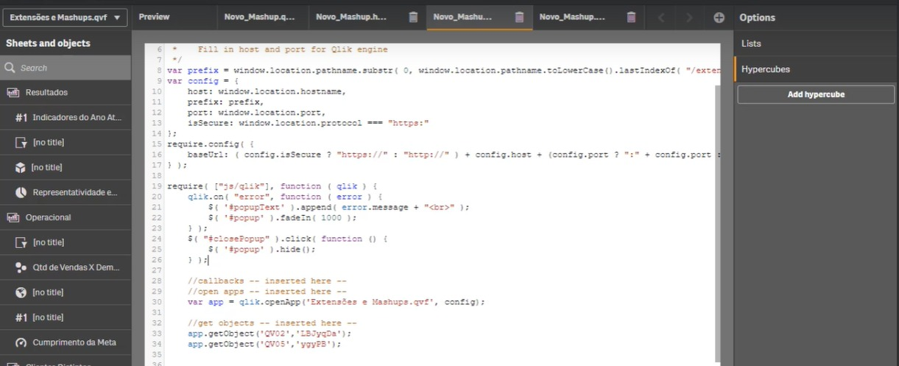

# Criação de MASHUP em Qlik Sense

## Entendimento do Problema

Este projeto tem como objetivo desenvolver um mashup utilizando o Qlik Sense, que consiste em uma página, site ou aplicativo da web que incorpora objetos do Qlik Sense de um ou mais aplicativos. A proposta é criar um serviço com uma interface gráfica exclusiva, facilitando a visualização e interação com os dados de forma customizada.

### Alternativa

Hoje o QLik Sense possibilita a criação de dashboards mais elaborados atráves da inserção de backgroud e o sistemas de botões vinculado aos indicadores, muito similar ao Power BI.

Esses backgrouds podem ser criados em diversas ferramentas de edição, atento apenas as parametros de grades, segue modelo criado no Figma:

   

      

Para esse projeto foi utilizado o ambiente Dev, para criação de MushUp para publicação dos objetos em pagina web.

#### Passos Seguidos

1. **Criação de Gráficos**: Vamos utilizar o Dash que construimos.

   

      

3. **Editor de Texto**: O editor de texto que utilizo é o Notepad++

   

      

4. **Integração dos Objetos HTML E JS**:

O primeiro passo é localiza o ID do Objeto na configurações do gráfico dentro do QLIK SENSE.

   

      

O template padrão do ambiente de desenvolvedor do QLIK SENSE criar as div de objeto pelo HTML.

CÓDIGO OBJETO = 

        	

		

			
	
				

					
Lucro do Ano

					
1

					
<i class="fas fa-coins"></i>

 A exportação é feito no ambiente dev ou no editor de texto, referenciando a div do objeto com o ID do gráfico obtido na etapa anterior:

 EXPORTAÇÃO DE GRÁFICO = 
    
        	//get objects -- inserted here --
        	app.getObject('QV_SELECOES','CurrentSelections');
         app.getObject('kpi_01_1','ygyQD');

   

      
 

   
## Resultado Final

O dashboard desenvolvido oferece uma visão completa dos indicadores financeiros da empresa, permitindo um monitoramento eficaz das métricas essenciais e facilitando a tomada de decisões estratégicas. Utilizando o Qlik Sense, a empresa pode acompanhar em tempo real a receita, o ticket médio, o lucro e as vendas, promovendo uma gestão financeira mais eficiente e proativa.
